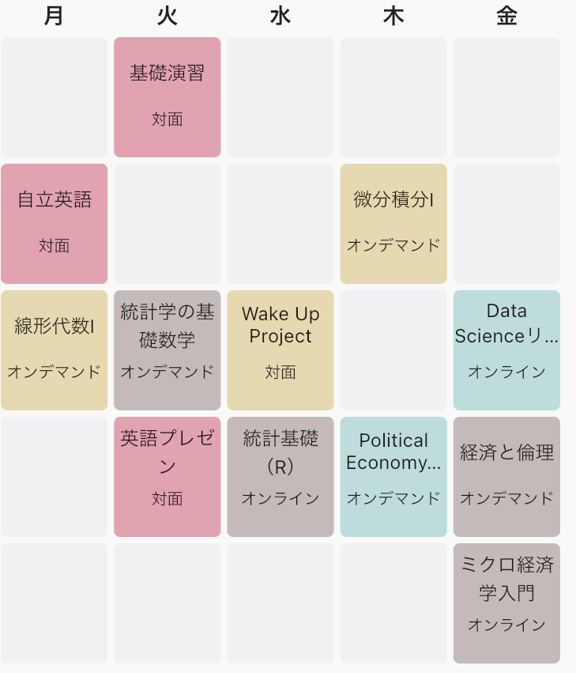
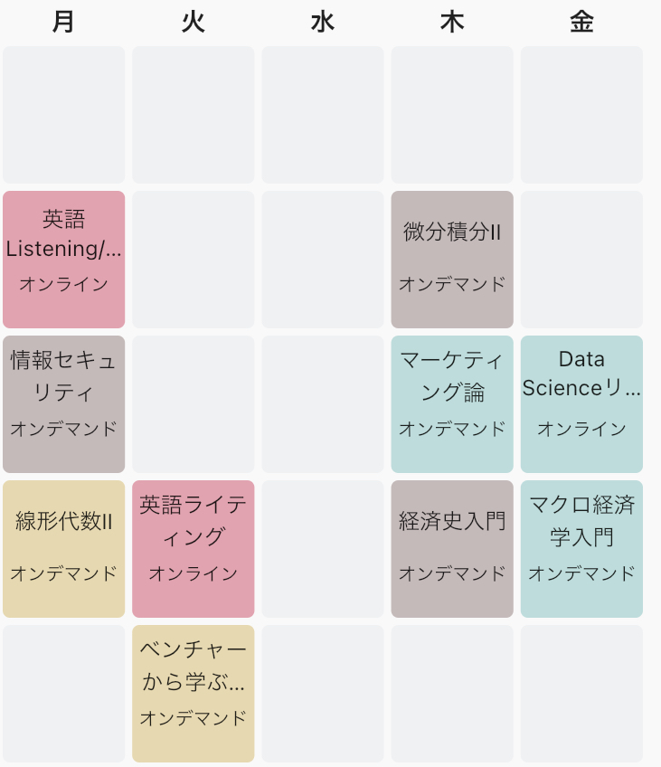
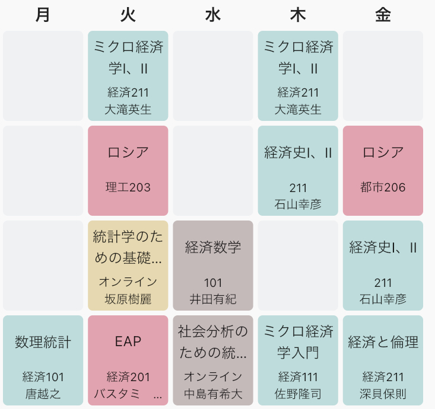
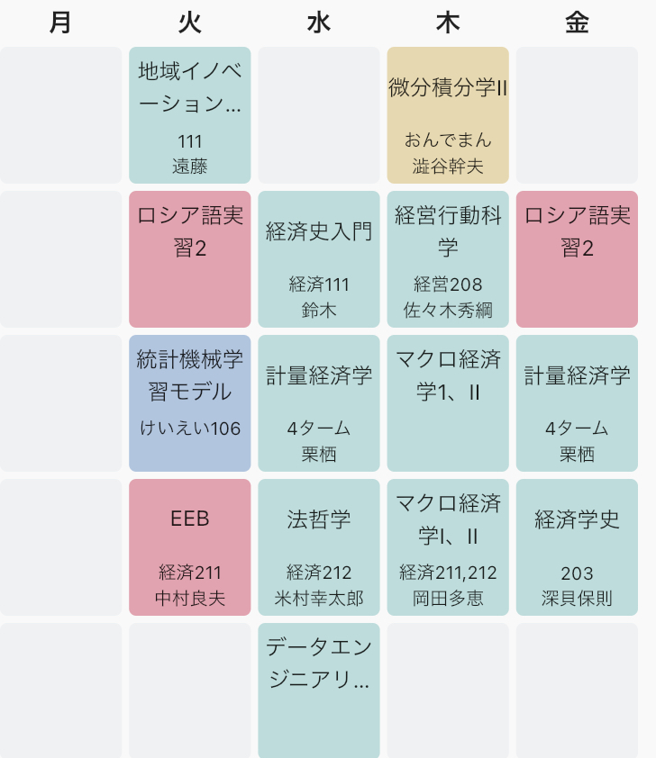

# 横浜国立大学 | 経済学部 の場合

---
# 自己紹介

---

### 名前：廣江友哉
### 背景：東京育ちで現在横浜在住
### 所属：横浜国立大学 経済学部 ２年生
### 趣味：ベース、プログラミング(web開発)

---

# 受験期の話

---

## 大学・学部・入試方法
### 令和2年度
  - 前期：一橋大学社会学部
  - 後期：横浜国立大学経済学部
### 令和3年度
  - 前期：一橋大学経済学部
  - 後期：横浜国立大学経済学部

### 結果、横浜国立大学へ進学

---
## 大学・学部への志望理由
### 大学
  - 国立を重視する親の意向
  - 姉のケツを追っかけて
  - 共通テストの点数から(出願直前時)
### 学部
  - 文系だけど数学は好きだから
  - 行動経済学を学びたかったから
  - 統計学に興味があったから

---
# 経済学部で学ぶこと

---
### 日本中の経済学部生が共通して学ぶこと
- ミクロ経済学(価格理論)への入門
需要曲線・供給曲線の導出から(一般)均衡理論までを学び、古典的なモデルで社会を説明する。
- マクロ経済学への入門
現在勉強中。

---
### 横浜国立大学の分類
- グローバル経済 ... 世界経済、途上国経済、国際経済史など
- 現代日本経済 ... 財政学、公共経済、労働経済、地域経済政策、日本経済など
- 金融貿易分析 ... 国際金融、金融論、ファイナンス、現代外国為替論など
- **経済数量分析** ... 計量経済学、数理統計、データサイエンス、ゲーム理論など
- 法と経済社会 ... 憲法、裁判法、行政法、経済法など

---
### ゼミに入れば...

もっと違う学問の勉強もできます。その学部に所属していてゼミを開講している教授のなかには、経済学と関係のない研究をしていらっしゃる先生もいます。例えば横国の経済学部の場合以下のような研究をしている先生がいます。
- 社会とコミュニケーション
- 映画論・脚本研究

---
# 時間割の例

---
## 1年春

- Wake Up Project
企業から出題された課題をチームで解決する授業。良い友達ができた。
- ポリティカルエコノミー入門
経済学を発展させてきた人の人生とその人が提唱した経済思想を時系列順に学ぶ授業。物語を読むような楽しい授業だった。
- 灰色の科目は落とした科目

---
## 1年秋

- Data Scienceリテラシー
R,Pythonというプログラミング言語を用いたデータ分析の手法を学習する授業。
- 経済学史
歴史上の経済学的な解釈を学ぶ歴史の授業。ex)産業革命がなぜ起きたのか。
- マクロ経済学入門
国単位の大きな視点で経済を分析する。GDPや物価、失業率を用いた分析。授業後半で、計量経済学の入門として部分識別の学習をしました。

---
## 2年春

- ミクロ経済学
全30回の講義で、単純化していない(変数が多いとか)価格理論とゲーム理論を学ぶ。
- 数理統計
確率変数や母関数、連続・離散の確率分布など統計学の基礎を学んだ。ゴリゴリの数学。めっちゃ面白い。
- 経済数学
おそらく、最適化問題の解法を学ぶ授業。線形計画法など。

---
## 2年秋Now!

- 地域イノベーション政策
経済を都市という単位で分析する授業。なぜオウルはITの最先端をゆくのかなど。
- 計量経済学
基本的な統計分析手法と経済学特有の数理分析手法を学ぶ。
- マクロ経済学
古典派とケインジアンによるマクロ経済を説明するためのモデルを学ぶ。

---
# 印象に残っている授業

---
### ロシア語

週２回の授業が必修で覚えることがたくさんあるのに、単位は他の授業の半分しかもらえないという地獄のような授業。先輩の言うことを聞いて楽だと言われている中国語にすればよかった。

### 統計学のための基礎数学

コンピュータの数学という分厚い本から統計学法海に役立つ分野を全15回の授業で学ぶ。毎回ハンドアウトという資料と演習問題をあらかじめ学習して、授業中に先生が画面を共有しながら添削するという少人数ならではの授業。先生との距離が近く楽しかった。楽しすぎて再履修した。

---
# 入ってよかったこと

---
### 横浜国立大学
- 起業風土がある
- そこら中に化け物がいる
- リスと猫とやぎに会える
### 経済学部
- 人文社会系の学問でもかなり学際的な分野なので何でも学べる
- 自然科学寄りの統計分析や理論も学べる
- 人文社会学寄りのアプローチも学べる

### 横浜国立大学の経済学部限定!!
- DSEPなら５年で修士を得られる！

---
# 後輩に伝えたいことの羅列

- 大学では起業している先輩ほど慎重に付き合え
  - 彼らは君たちに夢を見せることで低賃金で働かせようとしているかも
  - 業務委託契約には気を付けたまえ
- (大学でも)スタートダッシュが早い奴が強い
- (大学でも)コツコツと勉強している奴が成功している
- 免許と単位は大学一年生でとった方が良い
- 先輩のアドバイス(単位関係)は聞いた方が良い
卜部兼好だってそう言ってる。仁和寺にある法師をよめ
- 意欲があれば一年生から教授の元で学ぶこともできる
- 大学側は意外と学生の意見を取り入れてくれる